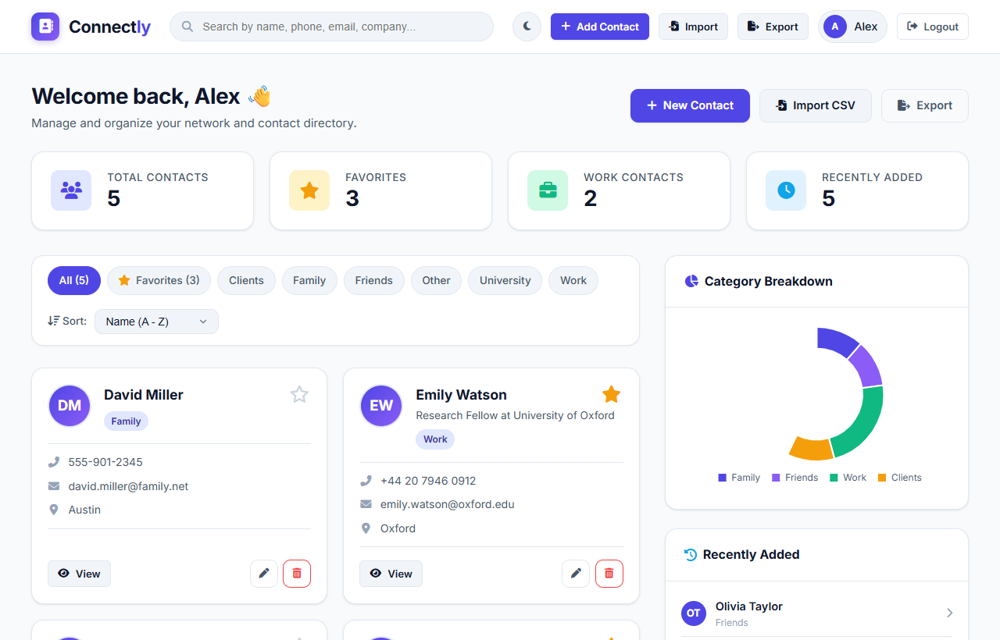
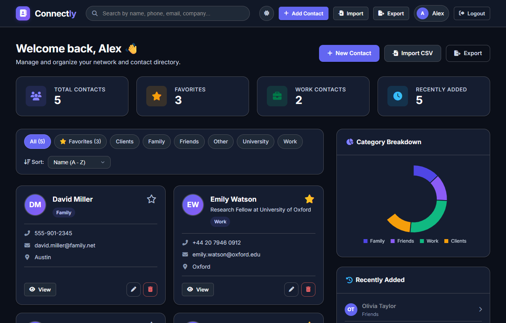
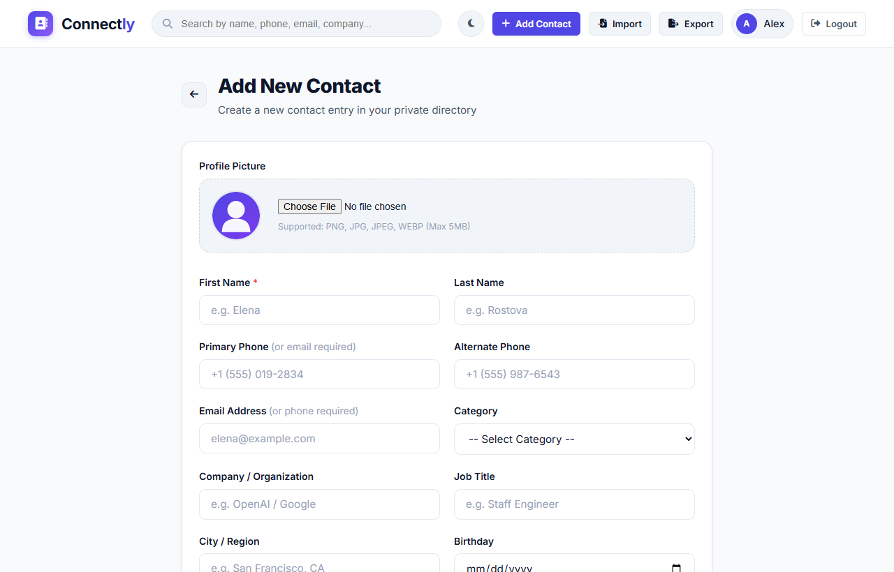
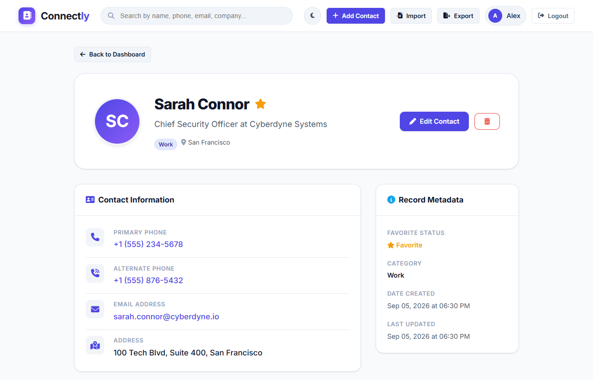
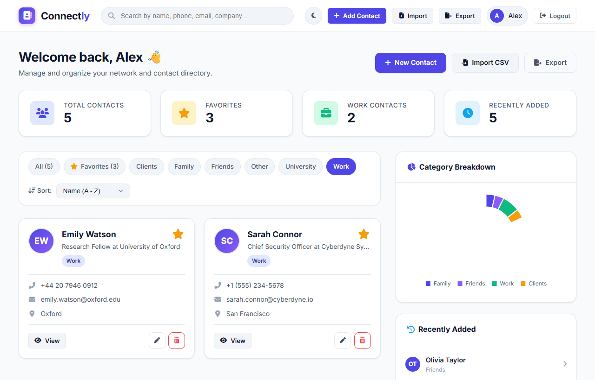
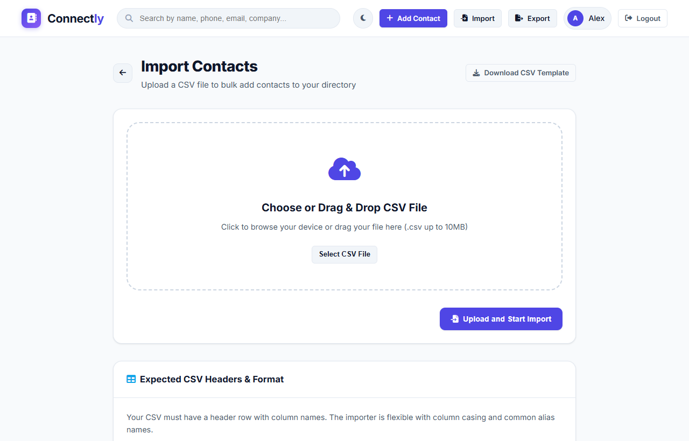
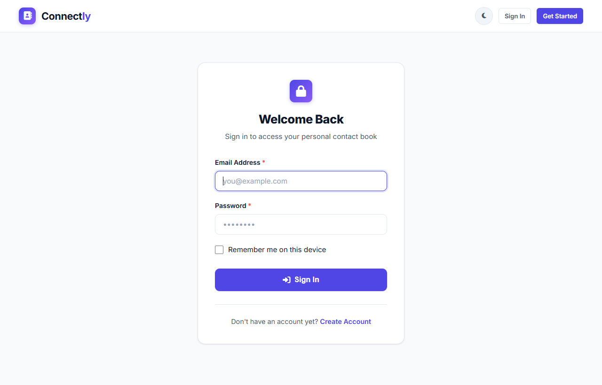
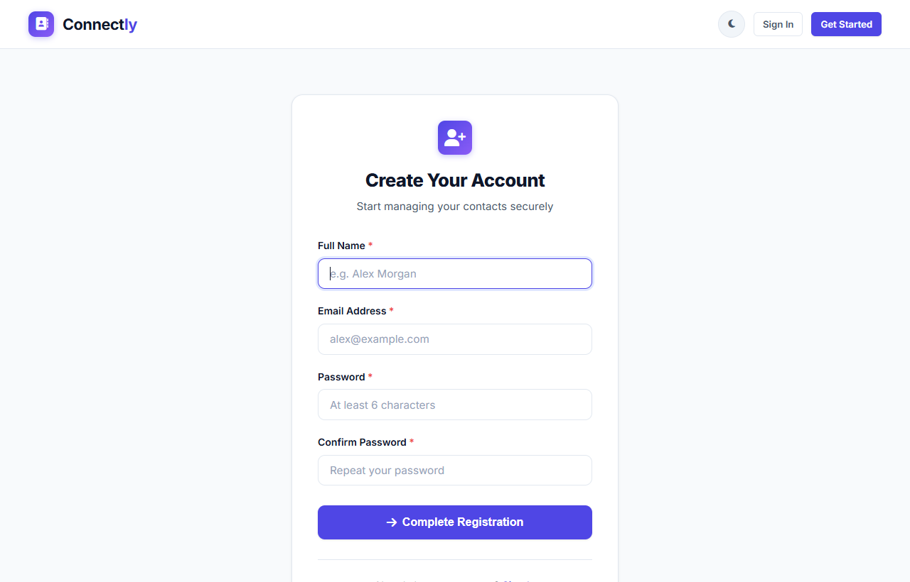

# Connectly

> Smart Contact Management Platform

Connectly is a full-stack contact management web application built with Python, Flask, SQLAlchemy, and SQLite. It provides personal and professional contact organization with privacy isolation, multi-criterion search and filtering, custom categories, favorites, duplicate detection, CSV import/export, contact statistics, and Dark/Light mode.

---

## Screenshots

### Dashboard
Overview of contact metrics, quick actions, contact cards, and category distribution analytics.



---

### Dark Mode
Full dark theme support with persistent preference across all views and forms.



---

### Add & Edit Contact
Contact creation and update form with real-time duplicate detection and image upload preview.



---

### Contact Details View
Comprehensive profile view displaying communication methods, notes, and metadata.



---

### Search & Filters
Instant search across names, phone numbers, emails, companies, and cities with category filtering.



---

### CSV Import
Bulk contact importer with header normalization, error logging, and duplicate skipping.



---

### Authentication
Secure user registration and login with session management.

| Sign In | Create Account |
|---|---|
|  |  |

---

## Features

- **Authentication & User Isolation**: User registration, login with "Remember Me", session management via Flask-Login, and password hashing with Werkzeug. Every user's data is strictly isolated.
- **Contact Management (CRUD)**: Create, view, edit, and delete contacts with fields for names, phone numbers, email, company, job title, address, city, birthday, notes, and avatars.
- **Confirmation Dialogs**: Modal confirmation dialogs before deleting contacts.
- **Contact Categories**: Organize contacts by default categories (*Family, Friends, Work, Clients, University, Other*) or custom user-defined categories.
- **Favorite Contacts**: Toggle favorite status with asynchronous AJAX updates.
- **Profile Picture Uploads**: Upload avatar images (PNG, JPG, JPEG, WEBP) stored with unique filenames and automatic file cleanup on replacement or deletion.
- **Duplicate Detection**: Real-time warnings and server-side checks for existing phone numbers or email addresses before creating contacts.
- **Real-Time Search**: Case-insensitive filtering across contact names, phone numbers, email addresses, companies, job titles, categories, and cities.
- **Sorting & Filtering**: Sort by Name (A-Z, Z-A), Newest, Oldest, or Recently Updated, combined with category filters.
- **CSV Import & Export**: Bulk import contacts with error tolerance and summary reports; export directory to standard CSV format.
- **Contact Analytics**: Live counters for total contacts, favorites, work contacts, recently added contacts, and a category distribution chart.
- **Dark / Light Mode**: Full theme customization with persistent storage in `localStorage`.
- **Responsive Layout**: Designed for mobile, tablet, laptop, and desktop screen sizes.
- **Flash Notifications**: Dismissable notification banners for operations, warnings, and errors.
- **Custom Error Pages**: Styled 403 Forbidden, 404 Not Found, 413 File Too Large, and 500 Server Error pages.

---

## Tech Stack

- **Backend**: Python 3, Flask 3, Flask-SQLAlchemy, Flask-Login, Werkzeug, Pillow, email-validator, python-dotenv
- **Database**: SQLite3, SQLAlchemy ORM
- **Frontend**: HTML5, CSS3, JavaScript (ES6+), Jinja2
- **UI Components & Charts**: FontAwesome 6, Chart.js 4
- **Testing**: Python `unittest`

---

## Project Structure

```
connectly/
├── app.py                     # Application factory, blueprint registration & error handlers
├── config.py                  # App configuration & upload limits
├── models.py                  # SQLAlchemy schema (User, Category, Contact)
├── run.bat                    # Windows one-click startup script
├── requirements.txt           # Python package dependencies
├── .env.example               # Environment variables template
├── .gitignore                 # Git ignore rules
├── README.md                  # Project documentation
├── LICENSE                    # MIT License
│
├── routes/
│   ├── __init__.py
│   ├── auth.py                # Registration, login, logout routes
│   ├── contacts.py            # CRUD operations, dashboard & filtering
│   ├── data_io.py             # CSV export, CSV import & sample template
│   └── api.py                 # AJAX endpoints for duplicate check, stats & categories
│
├── utils/
│   ├── __init__.py
│   ├── validators.py          # Input validation and duplicate detector
│   └── file_handler.py        # Safe image upload and disk cleanup
│
├── static/
│   ├── css/
│   │   └── style.css          # Stylesheet and dark/light mode themes
│   ├── js/
│   │   └── main.js            # Live search, theme switcher, AJAX favorites, modals
│   ├── images/
│   │   └── default-avatar.svg # Default avatar illustration
│   └── uploads/
│       └── avatars/           # Uploaded profile pictures
│
├── templates/
│   ├── base.html              # Base layout with navbar & alerts
│   ├── index.html             # Landing page for guests
│   ├── dashboard.html         # User dashboard with contacts grid & chart
│   ├── auth/
│   │   ├── login.html         # Sign in page
│   │   └── register.html      # Registration page
│   ├── contacts/
│   │   ├── add_contact.html   # Add contact form
│   │   ├── edit_contact.html  # Edit contact form
│   │   ├── contact_details.html # Contact profile view
│   │   └── import_contacts.html # CSV import dropzone & format guide
│   └── errors/
│       ├── 403.html           # 403 Forbidden page
│       ├── 404.html           # 404 Not Found page
│       ├── 413.html           # 413 File Too Large page
│       └── 500.html           # 500 Server Error page
│
├── docs/
│   └── screenshots/           # Application screenshots
│
├── sample_data/
│   └── contacts_sample.csv    # Sample CSV for testing import
│
└── tests/
    ├── __init__.py
    └── test_app.py            # Unit and integration test suite
```

---

## Installation & Setup

### Option 1: One-Click Launcher (Windows)
Double-click **`run.bat`** in the project directory. The script will automatically create the virtual environment, install dependencies, start the server, and open the application in your browser.

---

### Option 2: Manual Setup

#### 1. Clone the Repository
```bash
git clone https://github.com/snailyas131-byte/connectly.git
cd connectly
```

#### 2. Create and Activate a Virtual Environment

**On Windows (PowerShell / Command Prompt):**
```powershell
python -m venv venv
.\venv\Scripts\activate
```

**On macOS / Linux:**
```bash
python3 -m venv venv
source venv/bin/activate
```

#### 3. Install Dependencies
```bash
pip install -r requirements.txt
```

#### 4. Environment Configuration (Optional)
Copy the example environment file:
```bash
cp .env.example .env
```

#### 5. Run the Application
```bash
python app.py
```

The database initializes automatically on startup.

#### 6. Open in Browser
Navigate to:
```
http://127.0.0.1:5000/
```

---

## Automated Testing

Run the automated test suite covering authentication, CRUD operations, multi-user isolation, CSV processing, and duplicate detection:

```bash
python -m unittest discover -s tests -v
```

---

## CSV Import Format

When importing contacts from CSV, your file should include a header row with supported column names:

| Header | Required | Example |
|---|---|---|
| `first_name` | Yes | Sarah |
| `last_name` | No | Connor |
| `phone` | At least 1 contact method | +1 (555) 234-5678 |
| `email` | At least 1 contact method | sarah@cyberdyne.io |
| `alternate_phone` | No | +1 (555) 876-5432 |
| `company` | No | Cyberdyne Systems |
| `job_title` | No | Chief Security Officer |
| `address` | No | 100 Tech Blvd |
| `city` | No | San Francisco |
| `birthday` | No | 1985-05-12 |
| `category` | No | Work |
| `notes` | No | Key executive contact |

A sample CSV template is provided at `sample_data/contacts_sample.csv` and can also be downloaded directly from the import page.

---

## Security Practices

- **Password Hashing**: Stored passwords use salted hashes generated with Werkzeug.
- **Route Authorization**: Flask-Login protects private routes against unauthenticated requests.
- **User Ownership Verification**: Queries filter by `user_id == current_user.id`, ensuring complete isolation between accounts.
- **Safe File Uploads**: Uploaded files undergo MIME type verification, extension whitelisting, 5MB file size limits, and randomized UUID filenames.
- **SQL Injection Protection**: All queries utilize SQLAlchemy ORM parameterized statements.
- **Cross-Site Scripting (XSS) Protection**: Jinja2 automatic contextual escaping is enabled.

---

## Future Improvements

- Two-Factor Authentication (2FA) via TOTP
- vCard (.vcf) format import and export
- Email notifications and birthday reminders
- Multi-tag labeling for contacts
- Cloud profile image storage (AWS S3 / Cloudinary)

---

## Author

**Sana Ilyas**  
GitHub: [@snailyas131-byte](https://github.com/snailyas131-byte)

---

## License

This project is licensed under the MIT License. See [LICENSE](LICENSE) for details.
